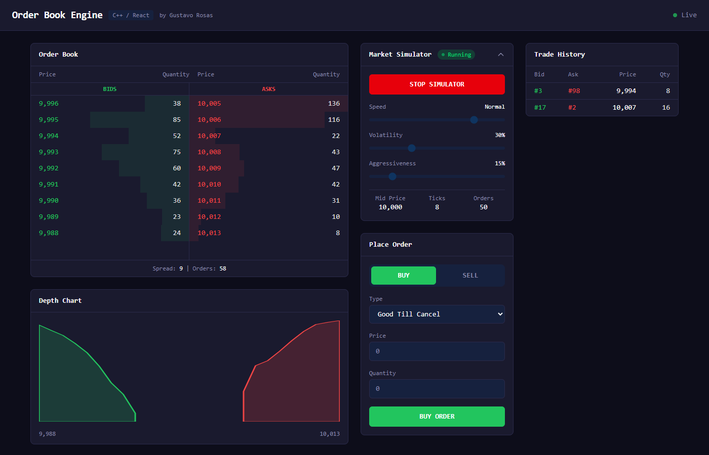
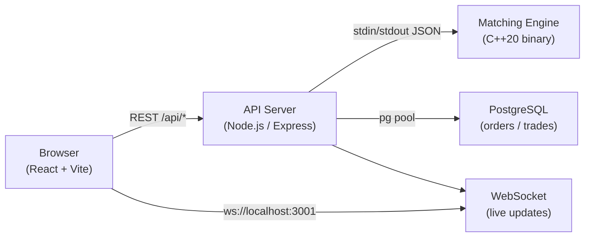

# Order Book Engine


A production-grade **limit order book and matching engine** written in C++20, with a real-time full-stack visualization layer. Orders are matched using strict **price-time priority** (FIFO within each price level).



---

## Features

- **Price-time priority matching** — orders at the same price are matched in strict arrival order (FIFO)
- **GoodTillCancel orders** — rest on the book until filled or explicitly cancelled
- **FillAndKill orders** — fill immediately up to available liquidity, cancel the remainder
- **O(1) order cancellation** — iterator caching in order index enables constant-time removal
- **Real-time WebSocket feed** — every book change broadcasts instantly to all connected clients
- **Market Simulator** — configurable bot with adjustable speed, volatility, and aggressiveness
- **Depth chart** — live SVG cumulative bid/ask visualization
- **PostgreSQL persistence** — all orders and trades stored with full timestamps
- **Docker Compose** — one command brings up the entire stack
- **40+ Google Tests** — covers matching logic, partial fills, cancellations, and edge cases
- **GitHub Actions CI** — automated build and test pipeline on every push

---

## Tech Stack

| Layer | Technology | Purpose |
|---|---|---|
| Matching Engine | C++20, CMake | Price-time priority order matching |
| Tests | Google Test | Unit tests for engine correctness |
| API Server | Node.js, Express 5, TypeScript | REST API + child process orchestration |
| Real-time | WebSocket (ws) | Live book and trade push to clients |
| Database | PostgreSQL 16 | Order and trade persistence |
| Frontend | React 19, TypeScript, Vite | Live order book visualization |
| Styling | Tailwind CSS 4 | Dark-theme trading UI |
| Containers | Docker, Docker Compose | Single-command deployment |

---

## Architecture

### System Overview



The C++ engine runs as a **child process**. The Node.js server communicates with it over newline-delimited JSON on stdin/stdout — no shared memory, no network overhead within the host, and the engine process can be replaced independently of the API layer.

### Core Data Structures

```
bids_  →  std::map<Price, OrderPointers, std::greater<Price>>
asks_  →  std::map<Price, OrderPointers, std::less<Price>>
index_ →  std::unordered_map<OrderId, OrderEntry>
```

- **`std::map` for price levels** — O(log P) insertion and best-price access at `begin()`. Sorted automatically, no explicit sorting needed.
- **`std::list<OrderPointer>` within each price level** — FIFO queue. New orders append to the back; the front is always matched first. List iterators remain valid across insertions.
- **`std::unordered_map` order index** — Each `OrderEntry` stores both the `shared_ptr<Order>` and its `list::iterator`. This allows O(1) cancellation without scanning the price-level lists.

### Complexity

| Operation | Time Complexity | Notes |
|---|---|---|
| `AddOrder` | O(log P + M) | P = price levels, M = matches made |
| `CancelOrder` | O(1) | Iterator cached in order index |
| `ModifyOrder` | O(log P + M) | Cancel O(1) + re-add O(log P) |
| `GetSnapshot` | O(P) | Aggregates quantity per level |
| `MatchOrders` | O(M) | Called internally after every add |

---

## Getting Started

### Prerequisites

- [Docker Desktop](https://www.docker.com/products/docker-desktop/) (recommended)
- **Or** manually: g++ (C++20), CMake 3.20+, Node.js 20+, PostgreSQL 16

### Option A — Docker (Recommended)

```bash
git clone https://github.com/GusDawn123/orderbook.git
cd orderbook
docker-compose up --build
```

Open **http://localhost:5173** in your browser.

| Service | URL |
|---|---|
| Frontend | http://localhost:5173 |
| API | http://localhost:3001 |
| PostgreSQL | localhost:5432 |

### Option B — Manual Build

**1. Build the C++ engine**

```bash
cd engine
mkdir build && cd build
cmake .. -DCMAKE_BUILD_TYPE=Release
cmake --build . --config Release
```

**2. Start the API server**

```bash
cd server
npm install
ENGINE_PATH="../engine/build/orderbook_server" npx ts-node src/index.ts
```

**3. Start the frontend**

```bash
cd client
npm install
npm run dev
```

---

## Running Tests

### C++ Engine (Google Test)

```bash
cd engine/build
ctest --output-on-failure
```

Tests cover: full match, partial fill, price-time priority, FillAndKill behavior, order cancellation, modify atomicity, and multi-level matching.

### Node.js Server (Jest)

```bash
cd server
npm test
```

---

## Design Decisions

**Why `std::map` instead of `std::unordered_map` for price levels?**
Price levels must be iterated in sorted order to find the best bid/ask and walk through matches. `std::map` gives O(log P) insertion and keeps levels sorted automatically. An unordered map would require an explicit sort on every snapshot or match.

**Why a child process instead of embedding the engine in Node.js (N-API/WASM)?**
A separate process isolates the matching engine completely. A crash in the engine does not take down the API server. It also allows the engine to be compiled, tested, and replaced independently. The stdin/stdout JSON protocol is simple, debuggable, and adds negligible latency on localhost.

**Why `std::list` for orders within a price level instead of `std::deque`?**
List iterators are not invalidated by insertions or erasures elsewhere in the list. Storing the iterator in the order index enables O(1) cancellation without any search. A deque would invalidate iterators on modification, breaking this guarantee.

---

## License

MIT © 2025 Gustavo Rosas
